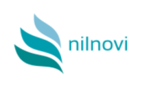

# Projet compilation 2022-2023

## Nom
Compilateur NNP

---

## Description
Réalisation d'un compilateur pour le langage NilNovi Procédural dans le cadre du projet de théorie des langages et compilation.

---

## Installation

---

## Usage

### Compilateur
#### Usage :
```
anasyn.py [-h] [-o outputfile] [-v] [-d] [-p] [--show-ident-table] inputfile
```
#### Arguments obligatoires:
`inputfile` : nom du programme à compiler
#### Options :
`-h, --help` : affiche le message d'aide  
`-o outputfile, --outputfile outputfile` : nom du fichier de sortie (stdout par défaut)  
`-v, --version` : affiche la version du programme  
`-p, --pseudo-code`: créé du pseudo-code au lieu de l'assembleur  
`--show-ident-table`: affiche la table des identificateurs  
&nbsp;

### VM
#### Usage :
```
vm.py [-h] [-d |-d -s] inputfile
```

#### Arguments obligatoires:  
`inputfile` : nom du programme compilé  

#### Options :  
`-h, --help` : affiche le message d'aide  
`-d, --debug` : affiche le nom de l'instruction et l'état de la pile à chaque étape  
`-s, --step-by-step` : permet d'exécuter les instructions une à une (à utiliser en mode debug)  

---

## Membres du groupe
Chakiya Ahamada  
Yasmine Bagtache  
Thomas Gerbaud  
Laurent Lin  
Haydar Selmi  
